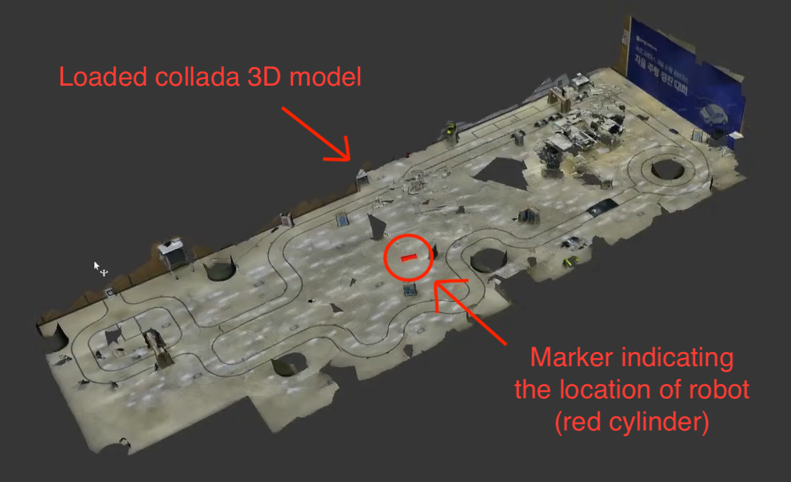
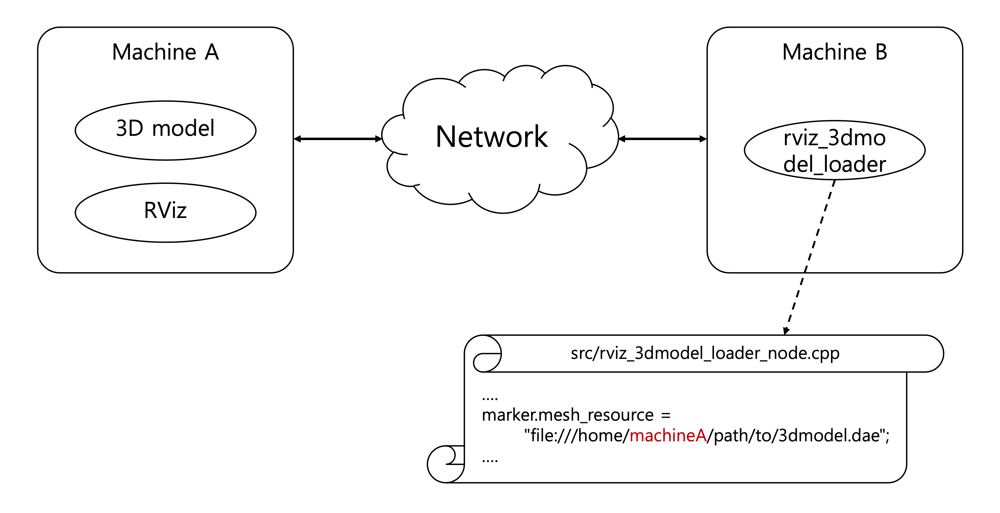

# rviz_3dmodel_loader
Load a 3D model in your RViz viewer. This ROS package was created based on [the rviz documentation about mesh resource marker](http://wiki.ros.org/rviz/DisplayTypes/Marker#Mesh_Resource_.28MESH_RESOURCE.3D10.29_.5B1.1.2B-.5D). You can import a 3D model just by cloning this package and locating the 3D model.

I used this package to visualize the space my robot is navigating using [Cartographer SLAM (Simultaneous localization and mapping)](https://google-cartographer-ros.readthedocs.io/).

The result: https://youtu.be/8LzUUPVyS1I?t=2107


# Install & Run
1. Clone this package into your ROS workspace.
```
$ cd ~/ros_ws/src
$ git clone https://github.com/nfyfamr/rviz_3dmodel_loader.git
```
2. Prepare your 3D model. Possible formats are binary .stl or Ogre .mesh in 1.0 or COLLADA .dae in 1.1.
3. Edit `src/rviz_3dmodel_loader_node.cpp` to locate your 3D model. Be aware that you should use absolute path and the path is described by [file URI scheme](https://en.wikipedia.org/wiki/File_URI_scheme). The triple slash (`///`) following `file:` is not a typo.
```
marker.mesh_resource = "file:///home/user/ros_ws/src/rviz_3dmodel_loader/src/scan.dae";
```
4. Build the package.
```
$ cd ~/ros_ws && catkin_make
```
5. Run rviz and load your 3D model.

### For the case you are running rviz in another machine
If you run rviz in machine A and this package in machine B, your 3D model should be in machine A and `mesh_resource` should indicate the path of the 3D model in machine A, refer the following diagram:


